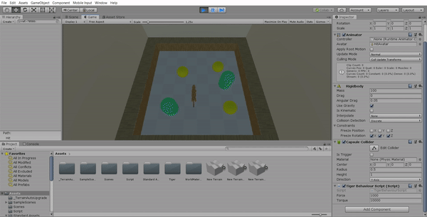

# Físicas
En la escena hay un jugador que es el tigre con el tag "Player" y como en la práctica anterior se moverá por fuerzas, 3 esferas rigidbody con el tag "GoodItem", 2 cápsulas rigidbody con el tag "badNPC", un foco con el tag "Spotlight", y finalmente la cámara, que esta vez la comentamos porque tendrá asignado el script "GameControllerBehaviourScript.cs" que se encargará de llamar eventos y controlar la llamada de la tecla "F" que al ser pulsada enciende o apaga el foco.

El tigre al colisionar con las esferas incrementa la fuerza con la que se mueve y al chocar con las cápsulas se reduce, esto se realiza gracias al script "TigerBehaviourScript.cs". De la misma forma las cápsulas cambiarán de color al chocar con el jugador y hará uso del script "BadLemonBehaviourScript.cs". 
## Ejecución

